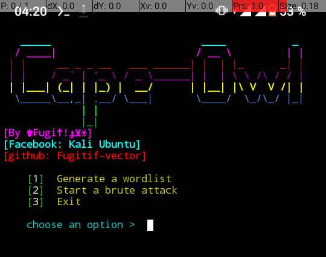

<h2 align="center"><u>Cape-Owl</u></h2>

<h4 align="center"> Hack facebook account with brute force attack ! </h4>

 

### [+] Description
Cape-Owl is a simple python tool made to perform brute force attack on facebook account, using this tool u can create personalized word lists depending on informations u give about the target.

### [+] Disclaimer
Using this tool to get access to someone else's Facebook account is illegal and formally prohibited ! The author is not responsible for any misuse of this tool, this is for educational purposes only.

### [+] Installation
To use Cape-Owl on ur terminal, install it with the following commands:
<li><code> apt update </code></li> 
<li><code> apt upgrade </code></li>
<li><code> pkg install python -y </code></li>
<li><code> pkg install git -y</code></li>
<li><code> pip install mechanize</code></li>
<li><code> git clone https://github.com/Fugitif-vector/CapeOwl</code></li>

<i> Or use the simple command</i>
<li><code> apt update; apt upgrade; pkg install python -y; pkg install git -y; pip install mechanize; git clone https://github.com/Fugitif-vector/CapeOwl</code></li>

### [+] Usage
Once u have installed the tool, run with these commands:
<li><code> cd CapeOwl </code></li>
<li><code> python co.py </code></li>

<i> Or </i>
<li><code> cd CapeOwl; python co.py </code></li>

<h4 align="center"><u>Demo</u></h4>
<h5><u>1- Create a word list</u></h5>

Choose the first option to create a word list. 
U have to provide all information u have regarding ur target (name, surname, birthday...). The more information you provide, the more likely you are to find the correct password.

Give the informations one by one. When you have no more information to add, enter the sign / 
Take example on the picture below:

<h5><u>2- Start a brute force attack</u></h5>

To start a brute attack, choose the 2nd option. U will have to provide the id/email/phone number of ur target and the path of the word list file. 
If u used Cape-Owl to create the word list, just enter the name of the file; else, give the full path of the file.

Take example on the picture below:

<h5><u>3- random attack</u></h5>

This option give u the opportunity to test a specified password on random accounts as described in the below picture:

### [+] Note !!!
When a brute force attack is performed on an account, access to that account is temporarily disabled after a certain number of incorrect attempts. It's a security measure that you can't do anything about. 

Once account access is disabled, Cape-Owl will let you know and stop the process. 
You can relaunch it later, but before, remember to delete the words already tested in the word list.

### [+] Contact me

Facebook : 
 
[Kali Ubuntu](https://www.facebook.com/profile.php?id=100082908991551)
 
 
E-mail :  teamfugitifdev.h4ck@gmail.com
